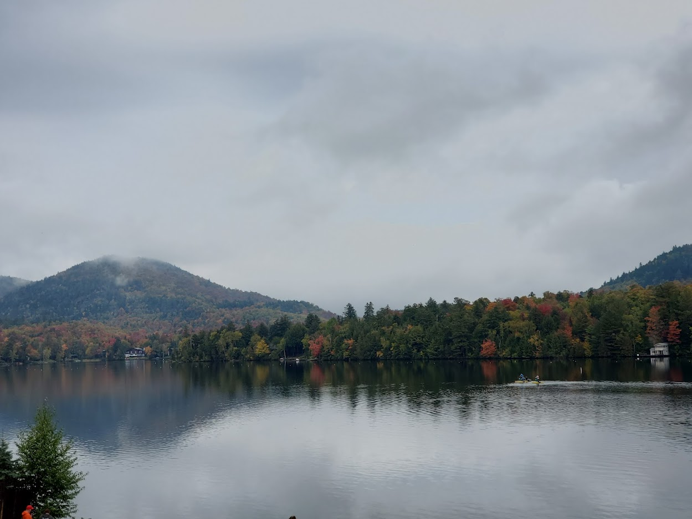
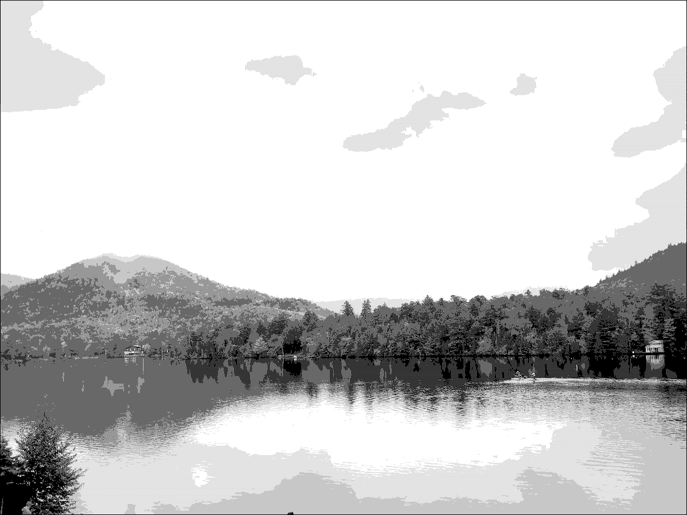
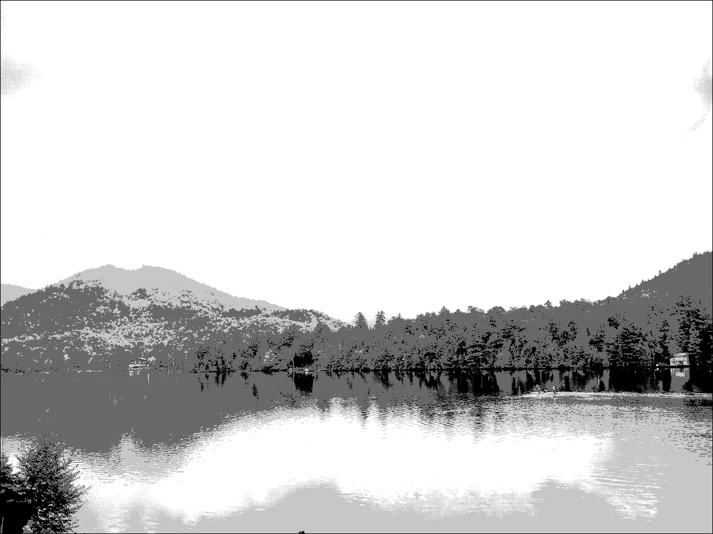
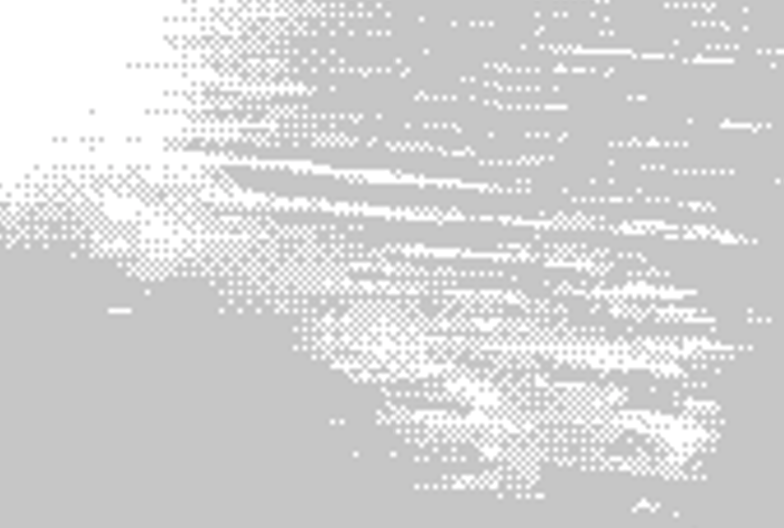
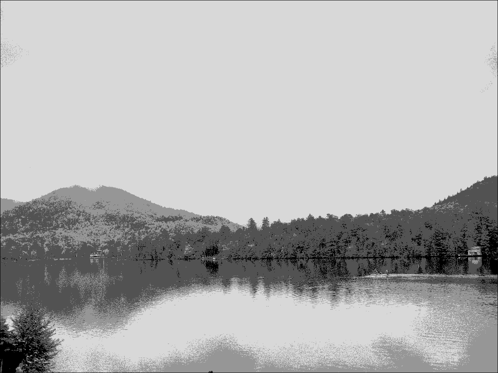

# Methods of image dithering

Dithering is a class of methods that apply noise/distortions to a set of data to minimize quantization error. This is a useful concept for lossy audio compression, image compression, and more. The methods here are specifically concerned with approximating an original image using a very limited set of greyscale values. A larger color palette would result in closer replication of the original image, but the small palette used here highlights differences between methods. These methods work for color images as well, but I'm keeping them to greyscale to limit comparisons to luminance and texture.

## Original image:

## Greyscale image:
Values in original image mapped to greyscale by luminance. This is used as the input for each dithering algorithm. 

## Closest value mapping:
This method is not dithering, but rather a simple mapping of each greyscale pixel to one of five colors (white -> 3 shades of Grey -> Black). This is sort of a worst-case dithering application, as much of the details in the original image are lost, there is very visible color banding, etc. Essentially, this is what happens when the number of colors in the image is reduced with little finesse. Dithering attempts to reproduce the details of the original image, while still only needing a small set of base colors.

## Floyd-steinberg dithering:
This process also maps pixels in the full greyscale image to values in the palette, but has the added feature of propegating errors to adjacent pixels. This allows the outputted image to approximate values outside of the palette by mixing values in the palette. While the below image is clearly still quite distorted compared to the original greyscale, it is a much better approximation than simply mapping each pixel to the closest value available in the palette. A few good illustrations are the gradient caused by the mist surrounding the mountaintop and the reflections of the trees along the shoreline. These details are ill-resolved in the closest value mapping, but are decently approximated here while using the exact same colors, just applied more intelligently.

## Ordered dithering
Ordered dithering selects each pixel's value via a texture map based on a Bayer matrix. This matrix adds a pattern of offsets across the whole image applied over an nxn pixel area. This example uses an 8x8 [bayer matrix](https://en.wikipedia.org/wiki/Ordered_dithering), meaning the pattern is applied in 64-pixel squares across the whole image. A characteristic of this dithering method is the hatching patterns that it creates in many areas of the image (see the zoomed-in image below). For this particular image, this method does a good job or replicating the gradients in the water close to the camera, as well as some of the tree reflections along the shore line.

## White noise dithering
This method adds a random value to each pixel, thus forcing some pixels to change colors. This fuzzing helps to soften gradients, but the added noise reduces the detail in parts of the image, giving the final produce a somewhat grainy appearance. For the below image, I added a random +/-10 offset to each pixel value (which ranges from 0-255). This value could be tuned to a user's liking to best soften gradients in their image. Further enhancements could be using different noise distributions, such as brown noise to prioritize large gradients, pink noise to prioritize small gradients, etc.

