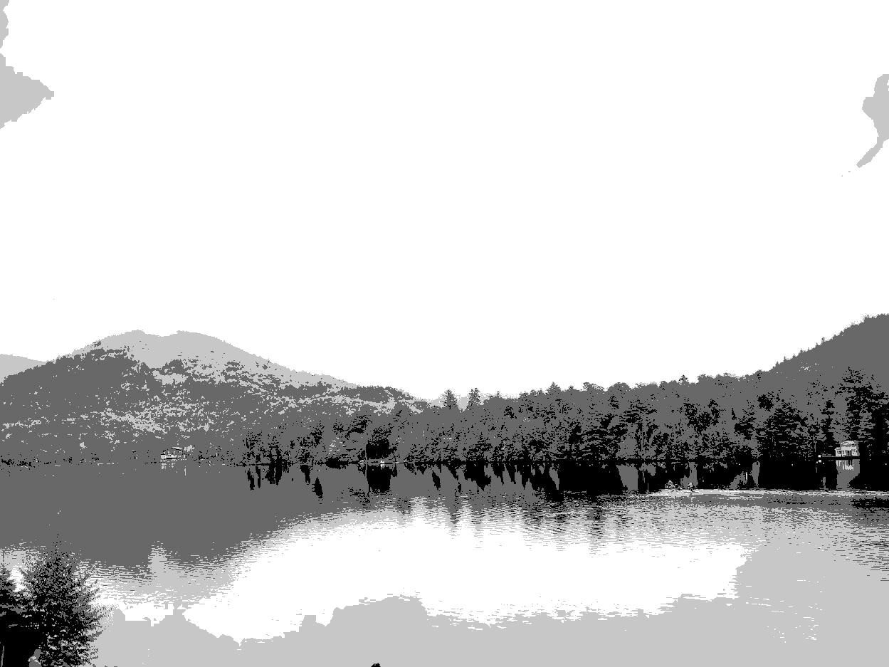

# image_dithering

Playing around with some dithering algorithms. This is intended to highlight differences and effectiveness of different dithering methods, not necessarily to replicate the original image. Dithering is done with a 5-color greyscale color palette unless otherwise specified. While the below dithering methods work for color images as well, I'm keeping them to greyscale for the moment to keep comparisons to luminance and texture.

## Original image:

## Greyscale image:
Values in original image mapped to greyscale by luminance. This is used as the input for each dithering algorithm. 

## Closest value mapping:
This method is not dithering, but rather a simple mapping of each greyscale pixel to one of five colors (white -> 3 shades of Grey -> Black). This is sort of a worst-case dithering application, as much of the details in the original image are lost, there is very visible color banding, etc. Essentially, this is what happens when the number of colors in the image is reduced with little finesse. Dithering attempts to reproduce the details of the original image, while still only needing a small set of base colors.

## Floyd-steinberg dithering:
This process also maps pixels in the full greyscale image to values in the palette, but has the added feature of propegating errors to adjacent pixels. This allows the outputted image to approximate values outside of the palette by mixing values in the palette. While the below image is clearly still quite distorted compared to the original greyscale, it is a much better approximation than simply mapping each pixel to the closest value available in the palette. A few good illustrations are the gradient caused by the mist surrounding the mountaintop and the reflections of the trees along the shoreline. These details are ill-resolved in the closest value mapping, but are decently approximated here while using the exact same colors, just applied more intelligently.

